# tldx

Write architecture and flow diagrams as JSX. `tldx` lays them out and renders
them on a live [tldraw](https://tldraw.dev) canvas that reloads as you save.

You describe _what connects to what_. Layout, sizing, edge routing and label
placement are the tool's job — there are no coordinates in a `.tldx.jsx` file
unless you want them.



Source: [`docs/diagrams/debugging.tldx.jsx`](docs/diagrams/debugging.tldx.jsx). No
coordinates anywhere in it - the blame list is a `.map()` over a four-element
array, and the loop back onto "add a console.log" is a self-edge, `log -> log`.

## Install

```bash
npm i -g @zhebil/tldx
```

The package is scoped; the command it installs is plain `tldx`.

`tldx render` additionally needs Playwright, which is optional because it pulls
a browser binary:

```bash
npm i -g playwright && npx playwright install chromium
```

## A diagram

```jsx
// hello.tldx.jsx
import { Doc, Frame, Box, Edges } from "tldx";

export default function Hello() {
  return (
    <Doc layout="col" gap="80">
      <Box id="browser" label="Browser" color="grey" />

      <Frame id="system" name="acme.com" layout="row" gap="48">
        <Box id="api" label="API" />
        <Box id="cache" label="Redis" geo="ellipse" color="red" />
        <Box id="db" label="Postgres" geo="ellipse" color="blue" />
      </Frame>

      <Edges>{`
        browser -> api: HTTPS
        api -> cache: read-through
        api -> db
      `}</Edges>
    </Doc>
  );
}
```

```bash
tldx serve hello.tldx.jsx
```

That opens a browser tab and repaints on every save. The `"tldx"` import needs
nothing installed next to your diagram - the compiler resolves it to its own
bundled runtime.

Point `serve` at a directory instead and every `.tldx.jsx` file directly inside
it becomes its own page in that one tab:

```bash
tldx serve docs/diagrams/
```

It does not descend into subdirectories, and skips everything that is not a
`.tldx.jsx` file.

Because it's JSX, a
diagram is ordinary code: components for repeated shapes, `.map()` over a data
table, `import` a shared palette from another file.

## Commands

```
tldx serve   <file|dir>    watch and push to the live viewer (a dir serves every
                           .tldx.jsx directly inside it, one page each)
tldx check   <file>        parse + validate, exit non-zero on error
tldx render  <file> <out>  export a PNG/SVG, cropped to content
tldx measure <file>        print every shape's and edge's placed geometry
tldx absorb  <file>        fold canvas edits back into the source
tldx verify  <file>        does the source alone reproduce the canvas?
tldx overlay show <file>   what canvas edits are still unabsorbed
```

## Claude Code plugin

The `plugin/` directory ships `tldx` as a Claude Code plugin: a `PostToolUse`
hook that validates and renders a diagram every time the agent edits one, a
`/tldx:sync` command that folds canvas edits back into source, and a skill
teaching the component vocabulary.

```
/plugin marketplace add zhebil/tldx
/plugin install tldx@tldx
```

It calls the `tldx` binary on your `PATH`, so install the CLI first.

## Examples

[`examples/`](examples/) has five, each with its rendered SVG next to it - click
through to see what the source produces before installing anything.

|                                                   |                                                                           |
| ------------------------------------------------- | ------------------------------------------------------------------------- |
| [Web architecture](examples/web-architecture.svg) | a three-tier stack in swimlanes, with an external gateway                 |
| [TCP (RFC 793)](examples/tcp-rfc793.svg)          | the full state machine, laid out with nested `<Group>` and no coordinates |
| [Event-driven](examples/event-driven.svg)         | Kafka topics, consumers and a dead-letter redrive loop                    |
| [CI/CD](examples/cicd-pipeline.svg)               | gates, a manual approval, and every off-ramp                              |
| [Kernel](examples/kernel.svg)                     | user space to hardware, five rings deep                                   |

```bash
tldx serve examples/web-architecture.tldx.jsx
tldx serve examples/            # all five, one tab, one page each
```

## Docs

- [`docs/reference.md`](docs/reference.md) — every component, prop and enum
- [`docs/architecture.md`](docs/architecture.md) — how the compiler works

## Development

```bash
npm run check                                  # typecheck + lint + dep-lint + tests
npm run dev:cli -- serve examples/kernel.tldx.jsx   # run from source, no build
```

[`CONTRIBUTING.md`](CONTRIBUTING.md) covers the layer rules, where a test
belongs, and how to open a PR.

## License

MIT — see [LICENSE](LICENSE).

That covers tldx's own source. The viewer bundles the
[tldraw](https://tldraw.dev) SDK, which is separately licensed — free for local
and development use, commercial license required to deploy it as a service for
end users. Details in [NOTICE](NOTICE); the full text ships in
`licenses/tldraw-LICENSE.md`.

Using `tldx` locally to draw diagrams is development use, and needs no license.
