# Architecture

## The pipeline

A `.tldx.jsx` file is a JavaScript module whose default export returns a
`<Doc>`. Compiling it means running it and lowering what comes back.



Every diagram on this page imports `docs/diagrams/lib/vocabulary.jsx` - one
`LAYER` palette plus a handful of components - so `x.tldx.jsx` is the same blue
box wherever it appears, and a stage's colour _is_ the layer it lives in. Orange
touches the outside world, green is pure: the middle of the pipeline being all
green is a fact about the code, not a styling choice.

The stages, and the part the picture can't hold:

- **execute** (`infra/execute-jsx/`) - esbuild bundles the file and a fresh
  worker runs it, with a 2s hard timeout. The `"tldx"` import is aliased to the
  bundled runtime. esbuild's metafile is what gives us the watch set.
- **runtime** (`runtime/components`) - plain functions. No React, no
  reconciler: esbuild's JSX transform calls `jsx()`/`jsxDEV()`, which call the
  components directly. `jsxDEV`'s `source` argument becomes each node's span,
  which is why diagnostics have line numbers.
- **lower** (`domain/ir/lower.ts`) - AST → IR. Assigns ids, validates props and
  enums, resolves edge endpoints. Errors are collected, not thrown — one bad
  prop doesn't lose the rest of the diagram.
- **layout** (`domain/layout/`) - `hybridLayout` in `stack.ts` is the engine;
  the other five files are the stages drawn inside it.
- **emit** (`domain/emit/`) - positioned IR → a tldraw store snapshot.
- **overlay** (`domain/overlay/`) - applies canvas edits on top. Pure, and it
  never re-runs layout.
- **transport** (`infra/transport/`) - SSE to the viewer.

ELK is opt-in. `layout="auto"` hands ELK a _flat_ graph of one container's
already-sized direct children and takes back positions only — the routed edge
geometry is discarded, because `routing.ts` does that better with knowledge of
labels.

## Layers

```
cli/        composition root. The only place real adapters meet use cases.
app/        orchestration: compile-file, watch-and-serve, absorb, verify.
            app/ports/ defines the interfaces it talks through.
domain/     pure logic. No I/O, no clock, no fs.
infra/      adapters implementing the ports.
contracts/  wire types shared by CLI and viewer.
runtime/    the "tldx" module authors import.
viewer/     the browser bundle. Imports contracts/ only.
```

The dependency rules are enforced mechanically by `.oxlintrc.json` — one
`no-restricted-imports` block per layer, plus `import/no-cycle`. `npm run check`
fails on a violation, so you don't have to remember them. The one that bites
most often: `domain/` may not import from `infra/` or `app/`.



A glob that stops matching stops enforcing, silently, so
`tests/tools/lint-boundaries.test.ts` plants one rejected import per layer and
asserts the lint still catches it. Add a case there whenever you add a rule.

Every port in `app/ports/` has a colocated `.fake.ts` and `.contract.ts`. The
contract suite runs against both the fake and the real adapter, so the fake
can't drift into lying.

## Round trip

The canvas is editable, so the source and the canvas can disagree. Edits made
in the viewer land in a `*.tldx.overlay.json` sidecar next to the diagram —
never in the source, and never written by anything but a human moving shapes.

`tldx absorb` folds back the operations JSX can express exactly, and verifies
its own rewrite before it empties the overlay. `tldx verify` answers the
narrower question: does the source _alone_ now reproduce what the canvas
showed? Anything absorb can't express is left for a human to write.

Overlay sidecars are gitignored. They're a handoff buffer, not source.



## Why it's a file watcher and not an MCP server

An earlier attempt drove tldraw through an MCP server and died of timeouts and
brittleness. Editing a file is something an agent already does well, with tools
it already has. The renderer being a separate process that watches a file means
it can crash, restart, or be opened in a second tab without the agent knowing
or caring.

The cost is real: a `.tldx.jsx` file isn't self-contained portable text the way
a Mermaid snippet is. It needs the CLI to become a picture. That buys JSX
composition — components, props, `.map()` over a data table — which is what
makes large diagrams maintainable.
